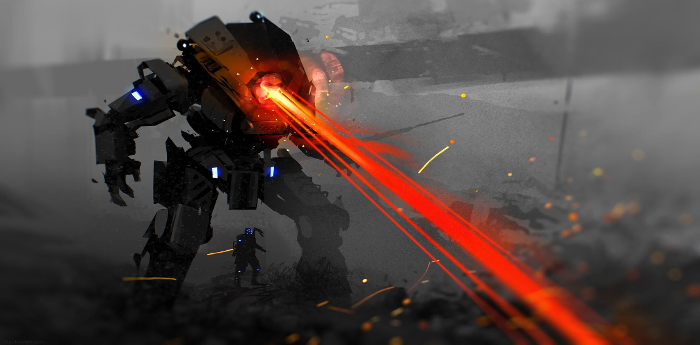

# Tigard High Game Development Club Ionic C++ Game Engine

{ width="800" height="600" style="display: block; margin: 0 auto" }

The Ionic C++ Game Engine is a simple game engine designed specifically for
['to be filled'](). This engine was developed by Tigard High Students during
the 2022-2023 school year.

- Read our [Project Guidelines](https://github.com/TigardHighGDC/Ionic/blob/main/docs/guidelines.md).
- Our [Issue Project Board](https://github.com/TigardHighGDC/Ionic/projects/3) keeps track of all current issues.
- Our [Code Review Project Board](https://github.com/TigardHighGDC/Ionic/projects/1) keeps track of all PR's under review.
- Join our [Discord Server](https://discord.gg/ZvsKGCFUQb).

## Maintainer List

- [Brandon Pacewic](https://github.com/BrandonPacewic)
- [Nathan St. John](https://github.com/Galaxy25)

## License

Copyright (c) TigardHighGDC

SPDX-License-Identifier: Apache-2.0
